# Kafka

The Kafka plugin lets you monitor your [Kafka](https://kafka.apache.org/) event streaming processes,
create consumers, producers, and topics. It also lets you connect to Schema Registry, as well as create and update schemas.

## Install the Kafka plugin

This functionality relies on the [Kafka](https://plugins.jetbrains.com/plugin/21704-kafka) plugin, which you need to install and enable.

1. Press **⌘ Cmd,** on macOS or **Ctrl Alt S** on Windows/Linux to open settings and then select **Plugins**.
2. Open the **Marketplace** tab, find the **Kafka** plugin, and click **Install** (restart the IDE if prompted).

With the Kafka plugin, you can:

1. Connect to:
   * [Kafka on a Confluent cluster](#connect-to-confluent-cluster)
   * [Kafka on an AWS MSK cluster](#connect-to-aws-msk-cluster)
   * [Custom Kafka cluster](#connect-to-a-custom-kafka-server)
   * [Kafka cluster using configuration properties](#connect-to-kafka-using-properties)
   * Optionally, [connect to Schema Registry](#connect-to-schema-registry)

2. [Produce and consume data](#produce-and-consume-data)

3. [Manage topics](#create-a-topic)

4. [Work with Schema Registry](#work-with-schema-registry)

## Connect to Kafka

### Connect to Kafka using cloud providers

#### Connect to Confluent cluster

1. Open the **Kafka** tool window: **View | Tool Windows | Kafka**.
2. Click  (**New Connection**). 
3. In the **Name** field, enter the name of the connection to distinguish it between other connections. 
4. In the **Configuration source** list, select **Cloud**, and then, in the **Provider** list, select **Confluent**. 
5. Go to [https://confluent.cloud/home](https://confluent.cloud/home). On the right side of the page, click the settings menu, select **Environments**, select your cluster, and then select **Clients | Java**.
In the **Copy the configuration snippet for your clients** block, provide Kafka API keys and click **Copy**.
6. Go back to your IDE and paste the copied properties into the **Configuration** field.
7. Once you fill in the settings, click **Test connection** to ensure that all configuration parameters are correct. Click **OK**.

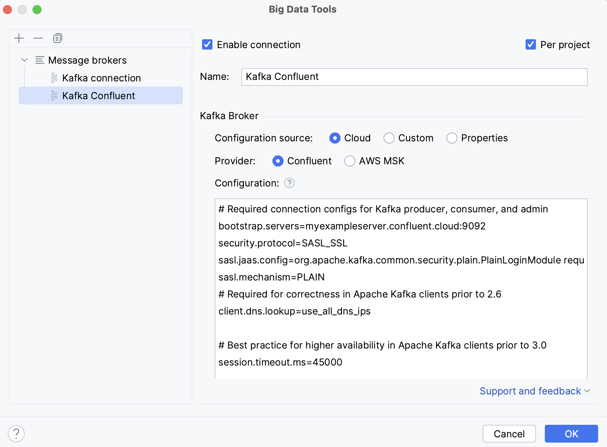

Optionally, you can set up:

* **Enable connection**: clear the checkbox if you want to disable this connection. By default, the newly created connections are enabled.

* **Per project**: select to enable these connection settings only for the current project. Clear the checkbox if you want this connection to be visible in other projects.

#### Connect to AWS MSK cluster

1. Open the **Kafka** tool window: **View | Tool Windows | Kafka**.
2. Click  (**New Connection**).
3. In the **Name** field, enter the name of the connection to distinguish it between other connections.
4. In the **Configuration source** list, select **Cloud**, and then, in the **Provider** list, select **AWS MSK**.
5. In the **Bootstrap servers** field, enter the URL of the Kafka broker or a comma-separated list of URLs.
6. In the **AWS Authentication list**, select the authentication method.

   *   **Default credential providers chain**: use the credentials from the default provider chain. For more information about the chain, refer to [Using the Default Credential Provider Chain](https://docs.aws.amazon.com/sdk-for-java/v1/developer-guide/credentials.html).

   *   **Profile from credentials file**: select a profile from your credentials file.

   *   **Explicit access key and secret key**: enter your credentials manually.
7. Optionally, you can [connect to Schema Registry](#connect-to-schema-registry).
8. If you want to use an SSH tunnel while connecting to Kafka, select **Enable tunneling** and in the **SSH configuration** list, select an SSH configuration or create a new one.
9. Once you fill in the settings, click **Test connection** to ensure that all configuration parameters are correct. Click **OK**.

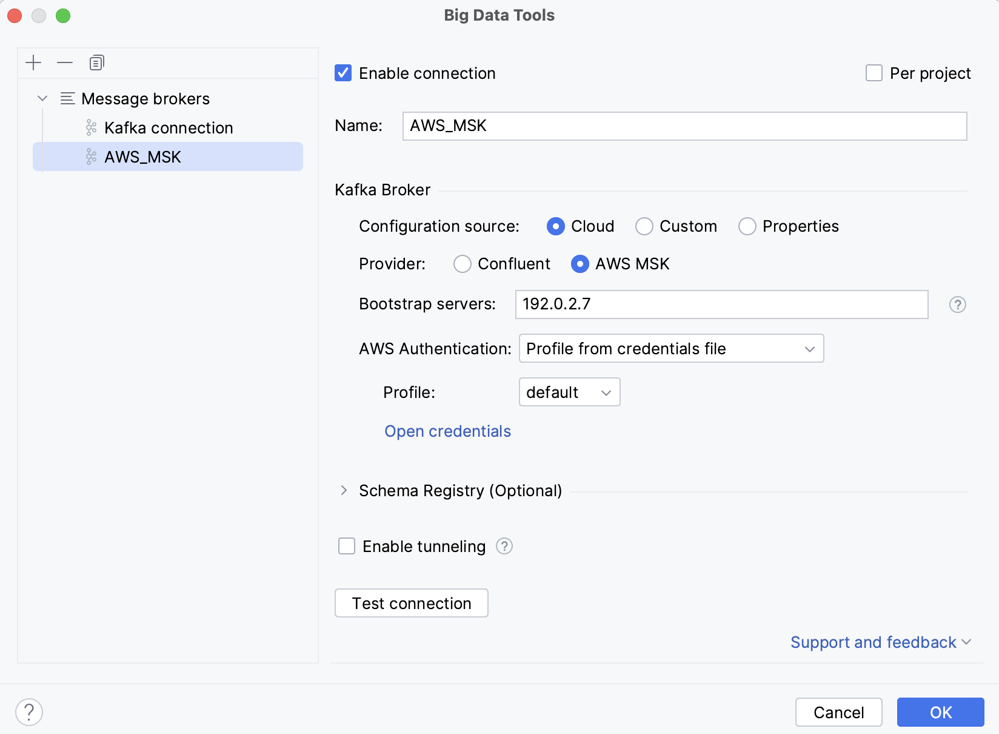

Optionally, you can set up:

* **Enable connection**: clear the checkbox if you want to disable this connection. By default, the newly created connections are enabled.

* **Per project**: select to enable these connection settings only for the current project. Clear the checkbox if you want this connection to be visible in other projects.

### Connect to a custom Kafka server

1. Open the **Kafka** tool window: **View | Tool Windows | Kafka**.
2. Click  (**New Connection**).
3. In the **Name** field, enter the name of the connection to distinguish it between other connections.
4. In the **Configuration source** list, select **Custom**.
5. In the **Bootstrap servers** field, enter the URL of the Kafka broker or a comma-separated list of URLs.
6.  Under **Authentication**, select an authentication method:
    * **None**: connect without authentication.
    * **SASL**: select an SASL mechanism (Plain, SCRAM-SHA-256, SCRAM-SHA-512, or [Kerberos](https://jetbrains.com/help/idea/big-data-tools-kerberos.html)) and provide your username and password.
     * **SSL**
       * Select **Validate server host name** if you want to verify that the broker host name matches the host name in the broker certificate. Clearing the checkbox is equivalent to adding the `ssl.endpoint.identification.algorithm=` property.
       * In the **Truststore location**, provide a path to the SSL truststore location (`ssl.truststore.location` property).
       * In the **Truststore password**, provide a path to the SSL truststore password (`ssl.truststore.password`property).
       * Select **Use Keystore client authentication** and provide values for **Keystore location** (`ssl.keystore.location`), **Keystore password** (`ssl.keystore.password`), and **Key password** (`ssl.key.password`).
    * **AWS IAM**: use AWS IAM for Amazon MSK. In the **AWS Authentication** list, select one of the following:
      * **Default credential providers chain**: use the credentials from the default provider chain. For more information about the chain, refer to [Using the Default Credential Provider Chain](https://docs.aws.amazon.com/sdk-for-java/v1/developer-guide/credentials.html).
      * **Profile from credentials file**: select a profile from your credentials file.
      * **Explicit access key and secret key**: enter your credentials manually.
7. Optionally, you can [connect to Schema Registry](#connect-to-schema-registry).
8. If you want to use an SSH tunnel while connecting to Kafka, select **Enable tunneling** and in the **SSH configuration** list, select an SSH configuration or create a new one.
9. Once you fill in the settings, click **Test connection** to ensure that all configuration parameters are correct. Click **OK**.

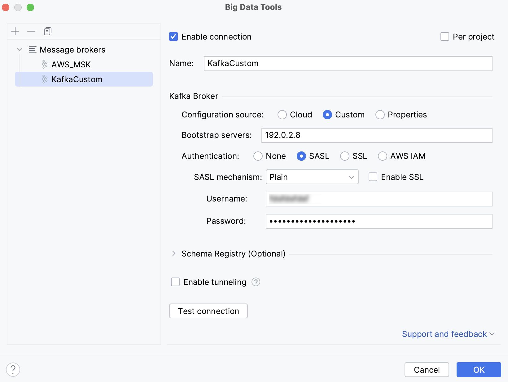

Optionally, you can set up:

* **Enable connection**: clear the checkbox if you want to disable this connection. By default, the newly created connections are enabled.

* **Per project**: select to enable these connection settings only for the current project. Clear the checkbox if you want this connection to be visible in other projects.

### Connect to Kafka using properties

1. Open the **Kafka** tool window: **View | Tool Windows | Kafka**.
2. Click  (**New Connection**).
3. In the **Name** field, enter the name of the connection to distinguish it between other connections.
4. In the **Configuration source** list, select **Properties**.
5. In the **Bootstrap servers** field, enter the URL of the Kafka broker or a comma-separated list of URLs.
6. Select the way to provide Kafka Broker configuration properties:
    * **Implicit**: paste provided configuration properties. Or you can enter them manually using code completion and quick documentation that IntelliJ IDEA provides.
    * **From File**: select the properties file.
7. Optionally, you can [connect to Schema Registry](#connect-to-schema-registry).
8. If you want to use an SSH tunnel while connecting to Kafka, select **Enable tunneling** and in the **SSH configuration** list, select an SSH configuration or create a new one.
9. Once you fill in the settings, click **Test connection** to ensure that all configuration parameters are correct. Click **OK**.

Optionally, you can set up:

* **Enable connection**: clear the checkbox if you want to disable this connection. By default, the newly created connections are enabled.

* **Per project**: select to enable these connection settings only for the current project. Clear the checkbox if you want this connection to be visible in other projects.

### Connect to Kafka in a Spring project

If you use Kafka in a Spring project, you can quickly connect to a Kafka cluster (or open an existing connection) based on the configuration properties from your application properties file.

1. Open your `application.properties` or `application.yml` file with at least the `bootstrap-servers` property defined.
2. In the gutter, click  and select **Create Kafka connection**. If you have already configured Kafka connections, you can also select them from this list.

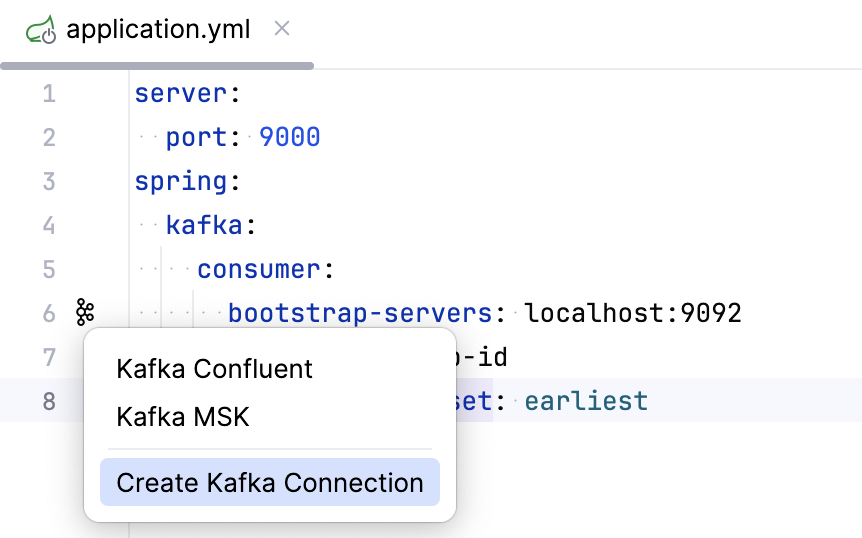

Additionally, if you have a method annotated with `@KafkaListener`,
you can click  next to it to quickly produce messages to the specified topic or consume data from them.

Once you have established a connection to the Kafka server, a new tab with this connection appears in the **Kafka** tool window. You can use it to [produce](#produce-data) and [consume](#consume-data) data, [create](#create-a-topic) and [delete](#delete-records-from-a-topic) topics. If you are [connected to a Schema Registry](#connect-to-schema-registry), you can also view, create, and update schemas.

Click  in any tab of the Kafka tool window to rename, delete, disable, or refresh the connection, or to modify its settings.

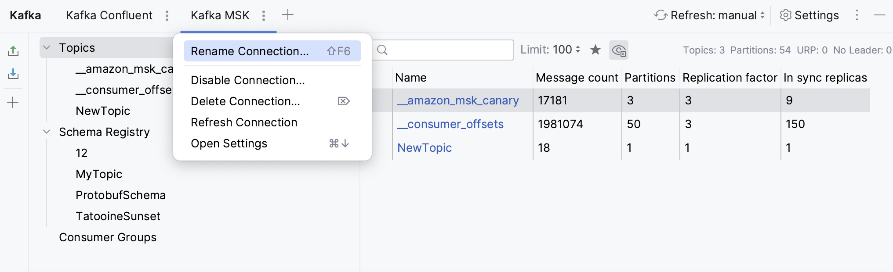

All the cluster topics are displayed in the Topics section. You can click  to show only favorite topics or  to show or hide internal topics. Click any topic to get more details on it, such as info on partitions, configuration, and schema.

## Create a topic

1. Open the **Kafka** tool window: **View | Tool Windows | Kafka**.
2. Click  (**New Connection**).
3. Select **Topics** and click  (alternatively, press **⌘ Cmd N** on macOS or **Alt Insert** on Windows/Linux).
4. Name the new topic, specify the number of partitions and replication factor, and click **OK**.

---
**NOTE:** If you have many topics, and you want some of them to be displayed on top of the list, you can mark them as favorite: right-click a topic and select **Add to Favorites**.

---

## Delete records from a topic

1. Open the **Kafka** tool window: **View | Tool Windows | Kafka**.
2. Click  (**New Connection**).
3. Under Topics, right-click a topic and select **Clear Topic** (or click  to the left of it). Click **OK** to confirm deletion.

## Produce and consume data

### Produce data

1. Open the **Kafka** tool window: **View | Tool Windows | Kafka**.
2. Click  (**New Connection**).
3. Select a Kafka connection and click **Producer**.
This will open a producer in a new editor tab.
4. In the **Topic** list, select a topic to write messages to.
5. Under **Key** and **Value**, select the message key and value.
6. If you are connected to a Schema Registry, you can select Schema Registry to check the data sent against a selected schema. You can generate random values:
    * Click  to generate a random value based on the selected type. This includes generating an entire JSON object based on the selected Schema Registry.
    * For more flexibility in generating random values, use the `${random...}` variables. When editing a JSON, Avro or Protobuf file, start typing random in the value field to see autocompletion options for possible random values. For example, you can use `"${random.integer(1,10)}"` to generate a random integer between 1 and 10.
   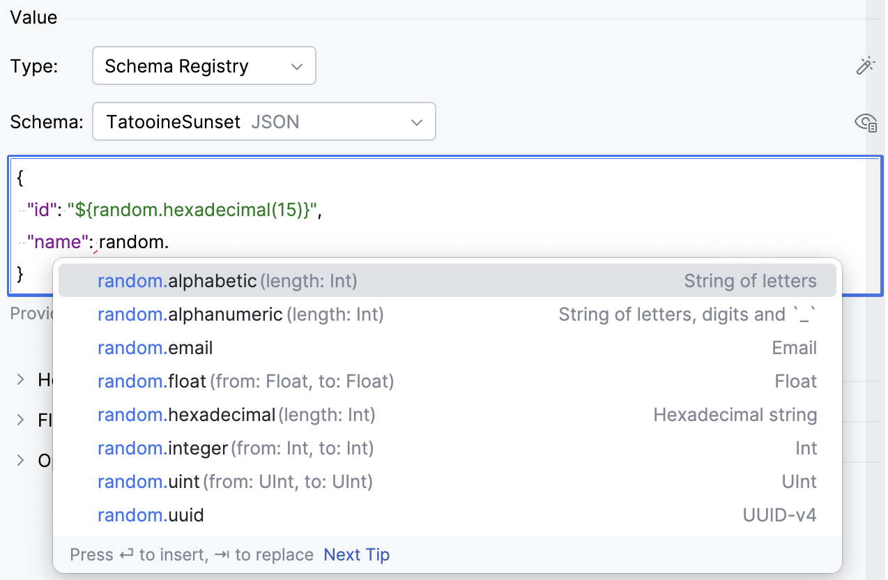

7. Under **Headers**, provide any custom headers. If you have them in JSON or CSV format, you can paste them into this section.
8. Under **Flow**, you can control the record flow:
   * In **Records at a time**, enter a number if you want to send multiple records simultaneously.
   * Select **Generate random keys** and **Generate random values** if you want the record data to be randomly generated.
   * Set the **Interval** in milliseconds between sending records.
   * Provide **Stop Conditions** if you want the producer to stop sending messages when either a specified number of records is reached or a specified amount of time has elapsed.
9. Under **Options**, provide additional options:
    * **Partition**: specify a topic partition, to which the record must be sent. If not specified, the default logic is used: The producer takes the hash of the key modulo the number of partitions.
    * **Compression**: select the compression type for data generated by the producer: **None**, **Gzip**, **Snappy**, **Lz4**, or **Zstd**.
    * **Idempotence**: select if you want to ensure that exactly one copy of each message is written in the stream.
    * **Acks**: select **Leader** if you want the leader to write the record to its local log and respond without awaiting full acknowledgement from all followers. Select **All** for the leader to wait for the full set of in-sync replicas to acknowledge the record. Keep **None** for the producer in order not to wait for any acknowledgment from the server.
10. Click **Produce**.

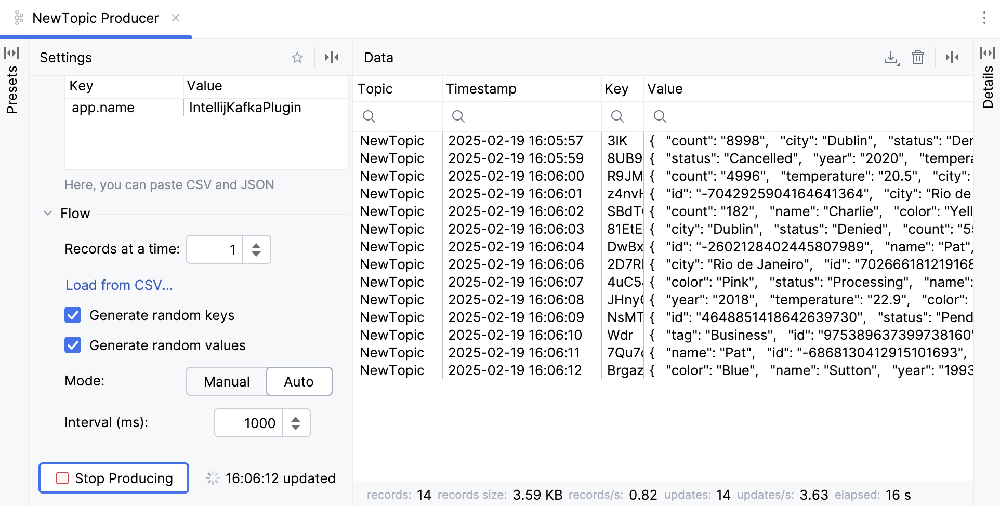

You can then click any record in the Data tab to show its details. You can also click  to enable statistics.

### Consume data

1. Open the **Kafka** tool window: **View | Tool Windows | Kafka**.
2. Click  (**New Connection**).
3. Select a Kafka connection and click **Consumer**. 
   This will open a consumer in a new editor tab.
4. In the **Topic** list, select a topic to which you want to subscribe.
5. Under **Key** and **Value**, select the data types for the keys and values of records that you are going to consume.
6. Use **Range and Filters** to narrow down the data for consumption:
   * In the **Start from** list, select a period or offset from which you want to consume data. Select **From the beginning** to get all records from the topic.
   * In the **Limit** list, select when to stop receiving data, for example, when a certain number of records is reached in the topic.
   * Use **Filter** to filter records by substring in their keys, values, or headers.
7. Under Other, configure additional parameters:
   * In the **Partitions** box, enter a partition ID or a comma-separated list of IDs to get records from specific partitions only.
   * In the **Consumer group** list, select a consumer group if you want the new consumer to be added to it.
8. Click **Start Consuming**.

 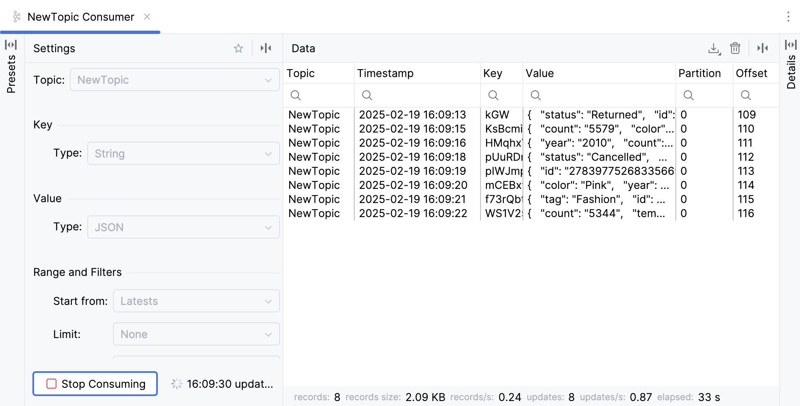

You can then click any record in the **Data** tab to show its details. You can also click Show Statistics to enable statistics.

---
**NOTE:** To quickly create producers and consumers, assign shortcuts to these actions. Press **⌘Cmd ⇧Shift A** on macOS or **Ctrl Shift A** on Windows/Linux, type **Producer** or **Consumer**, and press **⌥Option ↩Enter** on macOS or **Alt Enter** on Windows/Linux.

---

### Export data

You can download produced or consumed data in CSV, TSV, or JSON format.

1. Start [producing](#produce-data) or [consuming](#consume-data) data.
2. In the upper right part of the **Data** table, click  and select **CSV**, **TSV**, or **JSON**.
3. Select the output file location and click **Save**.

### Save a producer or consumer preset

If you often produce or consume data with the same keys, values, headers, or other parameters, you can save them as a preset. You can then reuse presets to quickly create a producer or a consumer.

1. In the **Kafka** tool window, click **Producer** or **Consumer**.
2. Specify the needed parameters and, on top of the producer or consumer creation form, click the  (**Save Preset**).

The parameters are saved as a preset, which is available in the **Presets** tab. Click a preset to apply it.

## Work with Schema Registry

Producers and consumers can use schemas to validate and ensure consistency of their record keys and values. The Kafka plugin integrates with Schema Registry and supports Avro, Protobuf, and JSON schemas. It enables you to:

* Connect to a Schema Registry
* Create, update, delete, and clone schemas
* Preview schemas in raw format or tree view
* Compare schema versions
* Delete schema versions

### Connect to Schema Registry

1. Create connection to a Kafka Broker using [cloud providers](#connect-to-kafka-using-cloud-providers), [custom server](#connect-to-a-custom-kafka-server), or [properties](#connect-to-kafka-using-properties).
2. If you use [Confluent](#connect-to-confluent-cluster), you can paste both Broker and Schema Registry properties into the **Configuration** field.
   Otherwise, expand the **Schema Registry** section and select a provider: **Confluent** or **Glue**.

   * Confluent:
     * **URL**: enter the Schema Registry URL.
     * **Configuration source**: select the way to provide connection parameters:
       * **Custom**: select the authentication method and provide credentials.If you want to use SSL settings different from those of the Kafka Broker, clear the **Use broker SSL settings** checkbox and provide the path for the truststore.
       * **Properties**: paste provided configuration properties. Or you can enter properties manually using code completion and quick documentation that the IDE provides.
   * Glue:
     * **Region**: select the Schema Registry region.
     * **AWS Authentication**: select the authentication method:
       * **Default credential providers chain**: use the credentials from the default provider chain. For more information about the chain, refer to [Using the Default Credential Provider Chain](https://docs.aws.amazon.com/sdk-for-java/v1/developer-guide/credentials.html).
       * **Profile from credentials file**: select a profile from your credentials file.
       * **Explicit access key and secret key**: enter your credentials manually.
     * **Registry name**: enter the name of a Schema Registry to which you want to connect or click  to select it from the list.
3. Once you fill in the settings, click **Test connection** to ensure that all configuration parameters are correct. Click **OK**.

### Create a schema

1. Open the **Kafka** tool window: **View | Tool Windows | Kafka**.
2. Click  (**New Connection**).
3. Select Schema Registry and click  (alternatively, press **⌘ Cmd N** on macOS or **Alt Insert** on Windows/Linux).
4. In the **Format** list, select the schema format: Avro, Protobuf, or JSON.
5. In the **Strategy** list, select the [naming strategy](https://docs.confluent.io/platform/current/schema-registry/fundamentals/serdes-develop/index.html#subject-name-strategy) and, depending on the selected strategy, set up the name suffix or select a topic. Alternatively, select **Custom name** and enter any name.

---
**NOTE**: If you use AWS Glue Schema Registry, you can only set the schema name.

---

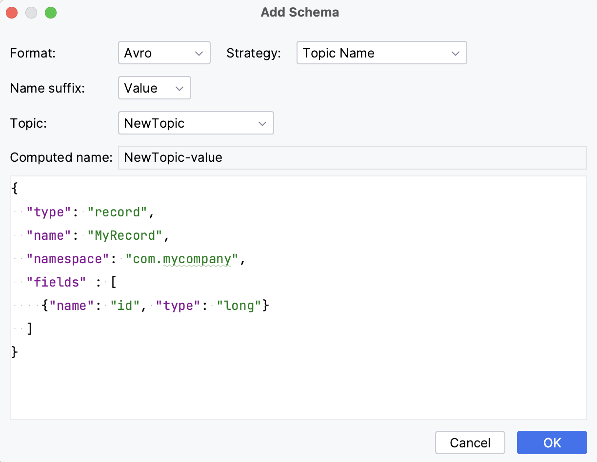

---
**TIP**: A quick way to create a schema based on an existing one is to clone it: right-click a schema and select **Clone Schema** or click  to the left of it.

---

You can preview schemas in a tree and raw view.

Tree View:

 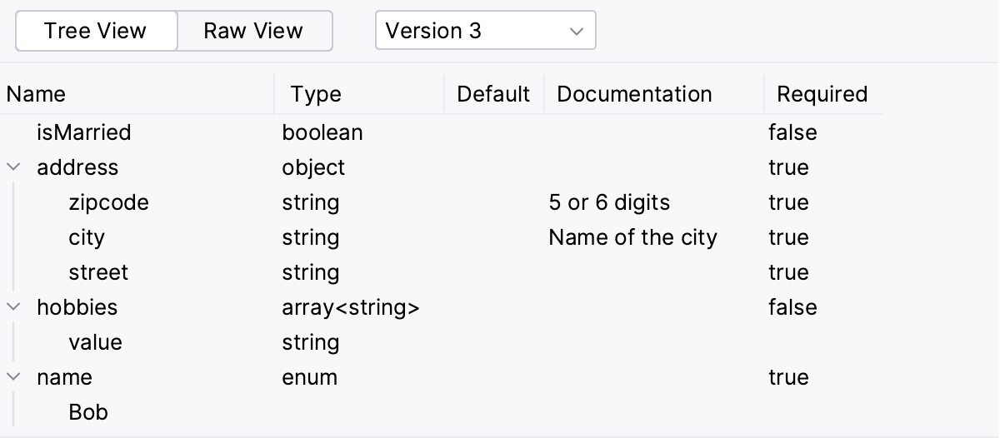

 Raw View:

 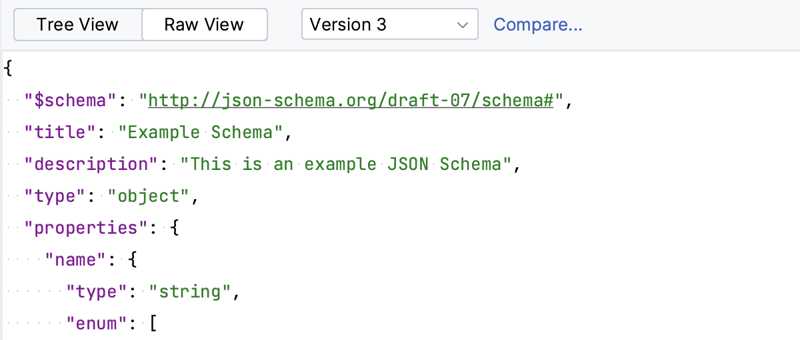

 ---
**NOTE**: If you have many schemas, and you want some of them to be displayed on top of the list, you can mark them as favorite: right-click a schema and select **Add to Favorites**.

---

### Compare schema versions

1. When connected to a Schema Registry, select a schema under **Schema Registry**.
2. Switch to **Raw View** and click **Compare**. The button is available if a schema has more than one version.

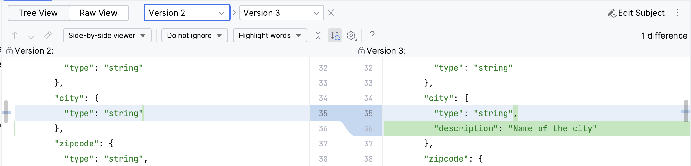

### Delete a schema version

If a schema has more than one version, you can delete a particular version. Schema Registry supports [two types of deletion](https://docs.confluent.io/platform/current/schema-registry/schema-deletion-guidelines.html): soft (when the schema metadata and ID are not removed from the registry after the version deletion) and hard (which removes all metadata, including schema IDs). The ability to choose depends on whether you use Confluent or AWS Glue Schema Registry:

* In Confluent Schema Registry, soft delete is used by default. You can choose to use a hard delete by selecting the **Permanent deletion** checkbox.
* AWS Glue Schema Registry always uses a hard delete.

1. Under Schema Registry, select a schema.
2. To the right of it, click  and select **Delete Version**.

---
**TIP**: To delete a schema completely with all its versions, right-click it and select **Delete Schema**.

---